# 정렬 비교 보고서 - Quick · Shell · Patience

- 이름: 김태연 (IT융합공학전공)
- 학번: 2026193014

- 이번 과제에서는 수업에서 학습한 Quick Sort와 Shell Sort, 그리고 수업에서 학습하지 않은 Patience Sort를 같은 환경에서 실행하여 비교하였다. 정렬 결과뿐 아니라 실행 시간, 비교 횟수, 이동 횟수, 추가 메모리, 재귀 깊이와 안정성도 함께 확인하였다.

- 구현: [`src/quickSort.c`](../src/quickSort.c) · [`src/shellSort.c`](../src/shellSort.c) · [`src/patienceSort.c`](../src/patienceSort.c)

- 실행: `make run` · `make test` · `make charts`

- 환경: 컨테이너 안 `gcc -std=c17 -Wall -Wextra -O2`

- GitHub: https://github.com/TaeYeonKim321/algorithm_hw_2026

---
## 차례
1. [코드 보고서](#1-코드-보고서)

2. [알고리즘 상세](#2-알고리즘-상세)

3. [알고리즘 실험](#3-알고리즘-실험)

4. [참고 자료 및 작성 과정](#4-참고-자료-및-작성-과정)

5. [한계 및 느낀 점](#5-한계-및-느낀-점)

---
## 1. 코드 보고서
### 1.1 기존 프로젝트 구조를 이용한 구현
이번 과제에서는 기존 프로젝트에 제공되어 있던 공통 정렬 인터페이스와 테스트·측정 구조를 바탕으로 비교 대상을 구성하였다. 각 알고리즘은 같은 형식의 함수로 등록되어 있어 `main.c`와 테스트 코드에서 같은 방식으로 실행할 수 있다.

현재 비교 대상은 다음 세 알고리즘이다.

```c
const SortAlgorithm SORT_ALGORITHMS[] = {
    {"quickSort","O(n log n)","O(1)",0,quickSort},
    {"shellSort","O(n^2)","O(1)",0,shellSort},
    {"patienceSort","O(n log n)","O(n)",1,patienceSort},
};
```

공통 인터페이스에서는 배열의 시작 주소, 원소 개수와 크기, 비교 함수, 통계 구조체를 전달한다. 이번 과제에서는 이 기존 구조에 Quick Sort와 Shell Sort를 추가하고, 수업 외 알고리즘인 Patience Sort를 새로 구현하여 같은 형식으로 등록하였다.

### 1.2 측정 방법
정렬 결과와 함께 `SortStats`를 이용하여 비교 횟수, 이동 횟수, 추가 메모리와 최대 재귀 깊이를 기록하였다.

```c
typedef struct SortStats {
    size_t compares;
    size_t moves;
    size_t extraBytes;
    size_t maxDepth;
} SortStats;
```

실행 시간은 `bench.c`의 측정 기능을 사용하였다. 작업 배열을 준비하는 과정은 측정에서 제외하고 정렬이 실행되는 구간의 시간을 `clock()`으로 측정하였다.

실행 시간은 컨테이너의 상태에 영향을 받을 수 있기 때문에 시간 값만으로 비교하지 않고 비교 횟수와 이동 횟수를 함께 확인하였다.

### 1.3 안정성 확인
안정성을 확인하기 위해 `key`와 `tag`를 가진 `Record`를 사용하였다.

```c
typedef struct Record {
    int key;
    int tag;
} Record;
```

비교 함수에서는 `key`만 사용하고, 정렬이 끝난 뒤 같은 `key`를 가진 원소들의 `tag` 순서를 확인하였다.

예를 들어

```text
(3,0) (1,1) (3,2) (1,3)
```

을 정렬한 결과가

```text
(1,1) (1,3) (3,0) (3,2)
```

와 같다면 같은 `key`를 가진 원소의 상대적인 순서가 유지된 것으로 볼 수 있다.

이번 구현에서는 Quick Sort와 Shell Sort는 불안정 정렬로 두었고, Patience Sort는 동일한 `key`에 대해 원래 입력 위치를 보조 기준으로 사용하여 안정적으로 동작하도록 구현하였다.

### 1.4 파일 구조
기존 프로젝트에서 사용한 주요 파일은 다음과 같다.

| 파일 | 역할 |
| --- | --- |
| `sort.h` | 공통 정렬 인터페이스와 통계 구조 정의 |
| `sortctx.h` | 정렬 구현에서 사용하는 공통 원소 접근·비교·이동 기능 |
| `sort.c` | 공통 도구와 정렬 알고리즘 등록표 |
| `quickSort.c` | Quick Sort 구현 |
| `shellSort.c` | Shell Sort 구현 |
| `patienceSort.c` | Patience Sort 구현 |
| `bench.c` | 실행 시간과 비교·이동 횟수 등의 측정 |
| `main.c` | 비교 결과와 CSV 출력 |
| `tools/plot.py` | CSV를 이용한 그래프 생성 |
| `tools/svgchart.py` | SVG 그래프 출력 |
| `report/` | 보고서, 결과 CSV와 그래프 저장 |

`sortctx.h`와 같은 공통 도구는 기존 프로젝트에서 제공된 기능을 그대로 활용하였다. 이번 과제에서는 정렬 알고리즘 구현과 비교 실험에 필요한 부분을 중심으로 수정하였다.

### 1.5 테스트
`make test`를 실행한 결과는 다음과 같았다.

```text
42 checks, 0 failures
```

테스트에서는 섞인 입력, 정렬된 입력, 역순 입력, 중복이 많은 입력, 동일한 값만 있는 입력, 원소 1개, 빈 배열 등을 확인하고, 정렬 결과를 표준 `qsort`와 비교하였다. 여러 배열 크기와 안정성 조건도 함께 확인하였다.

---
## 2. 알고리즘 상세
### 2.1 Quick Sort
Quick Sort는 기준이 되는 원소를 정한 뒤 배열을 나누고, 나뉜 각 부분에 같은 과정을 반복하는 분할 정복 방식의 정렬이다.

분할이 비교적 균형 있게 이루어지면 평균적으로 `O(n log n)` 정도의 시간이 걸리지만, 한쪽으로 크게 치우친 분할이 반복되면 최악의 경우 `O(n^2)`까지 증가할 수 있다.

이번 실험에서는 이 입력 의존성이 실제로 크게 나타났다. `n=4000`에서 무작위 입력의 최대 재귀 깊이는 26이었지만 정렬된 입력과 역순 입력에서는 3999까지 증가하였다. 비교 횟수도 무작위 입력의 52,846회에서 두 입력의 7,998,000회까지 증가하였다.

따라서 이번 구현에서는 평균적인 비교 횟수만 보는 대신 입력 형태에 따른 재귀 깊이도 함께 측정하였다.

### 2.2 Shell Sort
Shell Sort는 삽입 정렬을 일정한 간격의 원소들에 먼저 적용하고, 간격을 점점 줄여 가면서 마지막에 간격 1의 정렬을 수행하는 방식이다.

인접한 원소뿐 아니라 멀리 떨어진 원소도 먼저 이동시킬 수 있기 때문에 배열의 전체적인 순서를 정리하는 데 사용할 수 있다.

Shell Sort의 복잡도는 gap sequence에 따라 달라질 수 있다. 이번 구현에서는 비교표에서 `O(n^2)`로 기록하였으며, 별도의 입력 크기 비례 작업 공간을 사용하지 않아 추가 메모리는 `O(1)`로 기록하였다.

실험에서 Shell Sort의 최대 재귀 깊이는 1로 측정되었다.

### 2.3 Patience Sort
이번 과제에서는 수업에서 학습하지 않은 알고리즘으로 Patience Sort를 선택하였다. 기본적인 방법은 입력 원소를 여러 개의 pile로 나눈 뒤, 각 pile에 남아 있는 원소를 작은 값부터 선택하여 전체 정렬 결과를 만드는 것이다.

이번 구현에서는 pile을 정할 때 pile의 top들을 이분 탐색하고, 각 pile의 현재 원소를 합칠 때 min-heap을 사용하였다.

```text
[입력] > [각 원소가 들어갈 pile을 이분 탐색으로 결정] > [여러 개의 pile 생성]
   > [각 pile의 현재 원소를 min-heap으로 관리] > [가장 작은 원소를 반복적으로 선택] > [정렬 완료]
```

이 방식으로 구현하여 비교표에서는 `O(n log n)` 수준의 시간 복잡도로 기록하였다.

Patience Sort는 pile과 heap을 관리하기 위한 별도의 배열이 필요하기 때문에 Quick Sort와 Shell Sort보다 추가 메모리가 크다. `n=4000`에서 `extraBytes`는 128008B로 측정되었다.

또한 이번 구현에서는 동일한 `key`가 등장했을 때 원래 입력 위치를 보조 기준으로 사용하였다. 그 결과 동일한 `key`의 상대적 순서를 유지할 수 있었고, 안정성 검사에서도 안정으로 확인되었다.

---
## 3. 알고리즘 실험
### 3.1 실험 조건
모든 알고리즘은 같은 `Record` 배열과 같은 비교 함수를 사용하였다.

입력 형태는 다음 네 가지로 구성하였다.

- 무작위

- 정렬됨

- 역순

- 중복 많음

입력 형태에 따른 비교는 `n=4000`에서 수행하였고, 입력 크기에 따른 변화는 무작위 입력에서 `n=1000, 2000, 4000, 8000`으로 증가시키면서 측정하였다.

시간은 컨테이너 안에서 측정하였다. 실행 환경에 따라 시간 값은 달라질 수 있으므로 비교 횟수, 이동 횟수와 재귀 깊이도 함께 비교하였다.

### 3.2 n=4000 입력 형태별 결과
| 입력 | 알고리즘 | 시간(ms) | 비교 | 이동 | 최대 재귀 깊이 |
| --- | --- | ---: | ---: | ---: | ---: |
| 무작위 | Quick Sort | 1.028 | 52,846 | 75,393 | 26 |
| 무작위 | Shell Sort | 3.138 | 84,482 | 126,457 | 1 |
| 무작위 | Patience Sort | 1.242 | 64,336 | 8,000 | 1 |
| 정렬됨 | Quick Sort | 14.434 | 7,998,000 | 0 | 3,999 |
| 정렬됨 | Shell Sort | 0.174 | 40,006 | 80,012 | 1 |
| 정렬됨 | Patience Sort | 0.510 | 120,068 | 8,000 | 1 |
| 역순 | Quick Sort | 10.752 | 7,998,000 | 6,000 | 3,999 |
| 역순 | Shell Sort | 0.505 | 58,816 | 102,812 | 1 |
| 역순 | Patience Sort | 0.032 | 3,999 | 8,000 | 1 |
| 중복 많음 | Quick Sort | 1.346 | 1,011,892 | 39,177 | 530 |
| 중복 많음 | Shell Sort | 0.608 | 51,467 | 93,049 | 1 |
| 중복 많음 | Patience Sort | 0.529 | 95,782 | 8,000 | 1 |

시간 값은 같은 환경에서도 실행 시점에 따라 달라질 수 있다. 위 표는 이번 `make charts` 실행에서 함께 생성된 `results.csv`의 측정값을 사용하였다.
입력 형태별 비교(kinds)와 입력 크기별 비교(growth)는 별도로 수행한 실험이므로, 동일한 n에서도 실행 시간은 다르게 측정될 수 있다.

### 3.3 입력 형태에 따른 시간
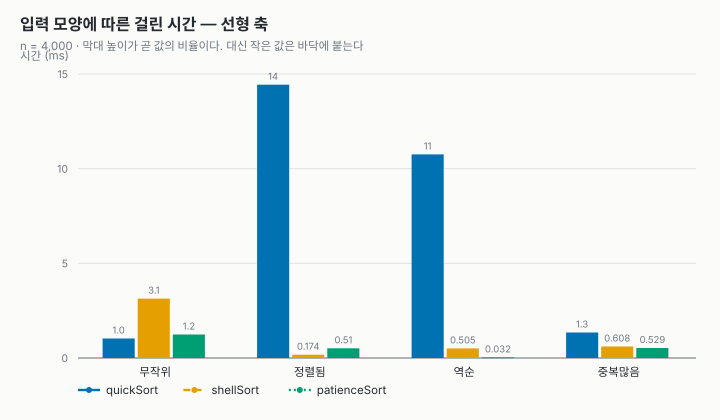

선형 축에서는 Quick Sort가 정렬된 입력과 역순 입력에서 크게 증가하는 모습을 확인할 수 있다. Shell Sort와 Patience Sort는 같은 입력에서 상대적으로 작은 값을 보였다.

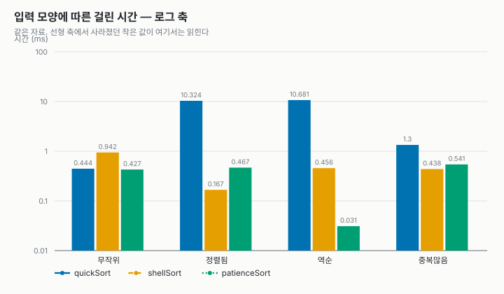

로그 축에서는 선형 그래프에서 바닥에 가까워 잘 구분되지 않는 작은 시간도 함께 확인할 수 있다.

### 3.4 비교 횟수
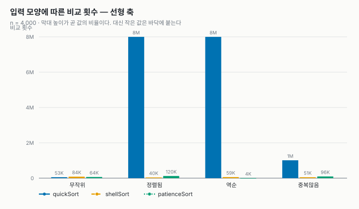

`n=4000`의 무작위 입력에서 Quick Sort는 52,846회, Shell Sort는 84,482회, Patience Sort는 64,336회의 비교를 수행하였다.

정렬된 입력과 역순 입력에서는 Quick Sort의 비교 횟수가 7,998,000회로 크게 증가하였다. 이번 구현에서 해당 입력에 대해 분할이 매우 불균형하게 이루어진 결과로 볼 수 있다.

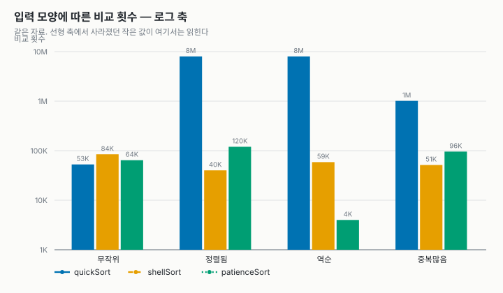

로그 축에서는 큰 비교 횟수 차이가 있는 경우에도 세 알고리즘의 값을 함께 확인할 수 있다.

무작위 입력에서 `n`을 두 배씩 증가시킨 결과는 다음과 같다.

| n | Quick 비교 | Shell 비교 | Patience 비교 |
| ---: | ---: | ---: | ---: |
| 1,000 | 11,084 | 14,720 | 13,230 |
| 2,000 | 24,433 | 35,885 | 29,110 |
| 4,000 | 52,846 | 84,482 | 64,336 |
| 8,000 | 112,030 | 204,896 | 141,108 |

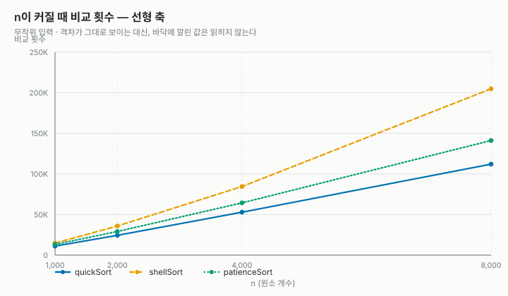

입력 크기가 증가할수록 세 알고리즘의 비교 횟수도 증가하였다.

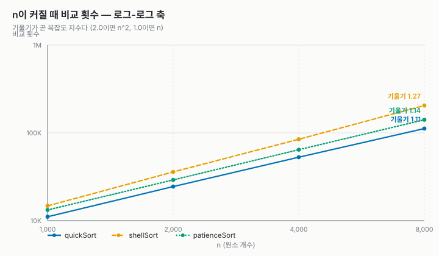

이번 측정 범위에서는 알고리즘마다 비교 횟수가 증가하는 형태가 달랐다. 실제 측정값은 이번 입력 조건에서의 결과이므로, 그래프만으로 이론적인 복잡도를 단정하지 않고 각 알고리즘의 복잡도와 함께 비교하였다.

### 3.5 n 증가에 따른 시간
무작위 입력에서 입력 크기를 증가시키는 growth 실험으로 측정한 시간은 다음과 같다.

| n | Quick(ms) | Shell(ms) | Patience(ms) |
| ---: | ---: | ---: | ---: |
| 1,000 | 0.082 | 0.170 | 0.085 |
| 2,000 | 0.194 | 0.519 | 0.233 |
| 4,000 | 0.396 | 0.980 | 0.413 |
| 8,000 | 1.096 | 2.387 | 1.019 |

이 표는 입력 형태별 비교(kinds)와 별도로 수행한 growth 실험의 측정값을 사용하였다.

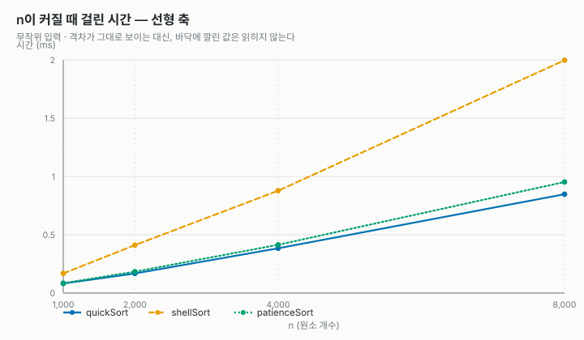

입력 크기가 증가하면서 세 알고리즘의 실행 시간이 모두 증가하였다. 이번 측정에서는 Quick Sort와 Patience Sort가 전체적으로 비슷한 수준에서 증가하였고, Shell Sort는 모든 측정 구간에서 더 큰 실행 시간을 보였다.

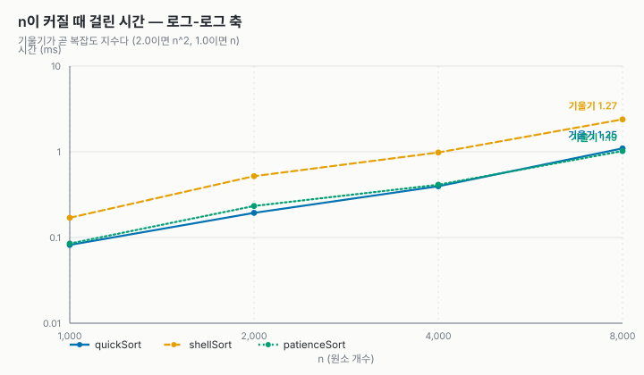

실행 시간은 같은 코드라도 실행 환경의 영향을 받을 수 있다. 따라서 그래프는 입력 크기가 증가할 때 시간이 어떻게 변하는지 확인하는 자료로 사용하였다.

### 3.6 이동 횟수와 재귀 깊이
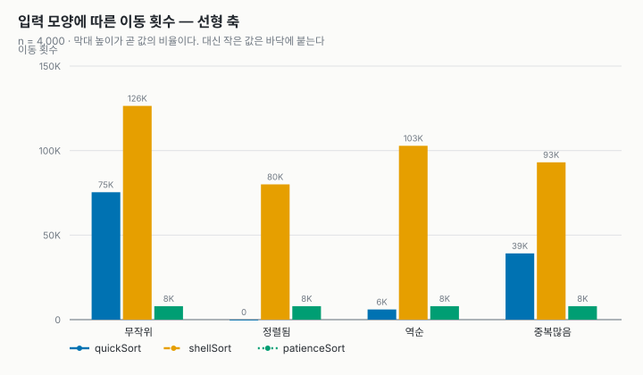

이동 횟수는 비교 횟수와 별도로 기록하였다. 알고리즘마다 원소를 이동시키는 방식이 다르기 때문에 비교 횟수만으로 동작량을 설명하기 어렵다.

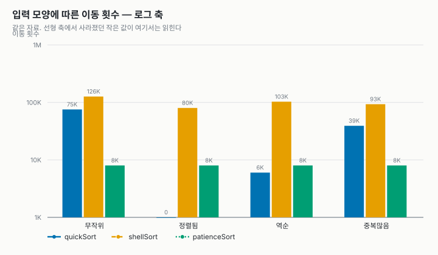

로그 축에서는 큰 이동 횟수와 작은 이동 횟수를 함께 확인할 수 있다.

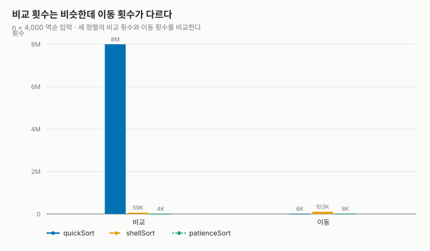

이번 구현에서 이동 횟수는 실제 데이터 이동을 기준으로 기록한다. 따라서 비교 횟수와 이동 횟수가 항상 같은 비율로 증가하지는 않는다.

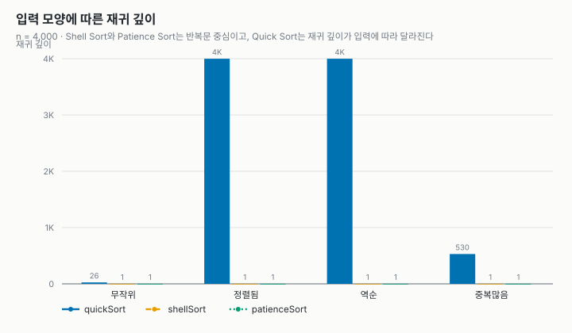

`n=4000`에서 Quick Sort의 최대 재귀 깊이는 무작위 입력 26, 정렬된 입력 3999, 역순 입력 3999, 중복 많음 530이었다. Shell Sort와 Patience Sort는 모두 1로 측정되었다.

특히 Quick Sort는 정렬된 입력과 역순 입력에서 재귀 깊이가 크게 증가하였다. 이 결과를 통해 같은 정렬 알고리즘도 입력 형태에 따라 실제 동작이 크게 달라질 수 있음을 확인하였다.

### 3.7 메모리와 안정성
`n=4000`에서 측정된 추가 메모리는 Quick Sort와 Shell Sort가 각각 8B, Patience Sort가 128008B였다.

| 알고리즘 | 추가 메모리 | 최대 재귀 깊이 | 안정성 |
| --- | ---: | ---: | :---: |
| Quick Sort | 8B | 입력에 따라 증가 | 불안정 |
| Shell Sort | 8B | 1 | 불안정 |
| Patience Sort | 128008B | 1 | 안정(본 구현) |

Quick Sort와 Shell Sort의 8B는 공통 작업에서 사용하는 원소 한 칸의 임시 공간이다. Quick Sort는 이와 별도로 재귀 호출에 따른 스택 공간을 사용하므로 `extraBytes`만으로 Quick Sort의 전체 메모리 사용량을 나타낼 수는 없다.

Patience Sort는 pile과 heap 등을 저장하기 위한 작업 공간이 필요하기 때문에 입력 크기에 따라 추가 메모리가 증가하였다.

중복이 많은 입력에서 안정성 차이도 확인하였다. Quick Sort와 Shell Sort는 불안정으로 측정되었고, Patience Sort는 이번 구현에서 동일한 key의 원래 순서를 유지하도록 구현되어 안정으로 측정되었다.

---
## 4. 참고 자료 및 작성 과정
이번 과제에서는 수업에서 학습한 Quick Sort와 Shell Sort를 선택하고, 수업에서 학습하지 않은 알고리즘으로 Patience Sort를 선택하였다.

Patience Sort의 기본적인 동작 원리는 Wikipedia의 Patience sorting 문서를 참고하였다.

- 참고 자료: [Wikipedia - Patience sorting](https://en.wikipedia.org/wiki/Patience_sorting)

보고서의 초안과 실험 결과의 정리는 직접 작성하였으며, 작성 후 문장 표현과 내용이 자연스러운지 확인하는 과정에서 AI를 활용하였다. 또한 Patience Sort를 구현하는 과정에서 pile 구성, 이분 탐색을 이용한 pile 선택, min-heap을 이용한 병합 방식과 C에서의 구현 방법을 이해하기 위해 AI의 설명을 참고하였다.

이후 기존 프로젝트의 인터페이스와 측정 구조에 맞게 코드를 작성하고 수정하였다. 작성한 코드는 `make test`로 정렬 결과를 확인하고, `make run`으로 측정 결과를 확인한 뒤 `make charts`로 그래프를 생성하였다.

Patience Sort는 동일한 `key`가 있을 때 원래 입력 위치를 보조 기준으로 사용하도록 구현하여 안정성을 유지하였다.

---
## 5. 한계 및 느낀 점
이번 실험의 실행 시간은 하나의 컨테이너 환경에서 측정한 값이므로 다른 CPU나 시스템 부하, 컴파일 옵션에서는 달라질 수 있다. 따라서 시간 값만으로 알고리즘의 성능을 판단하기보다 비교 횟수와 이동 횟수를 함께 보는 것이 필요하다.

Quick Sort에서는 입력 형태에 따라 차이가 크게 나타났다. 무작위 입력에서는 최대 재귀 깊이가 26이었지만 정렬된 입력과 역순 입력에서는 3999까지 증가하였다. 이를 통해 알고리즘의 평균적인 복잡도와 특정 입력에서 나타나는 실제 동작을 함께 확인할 필요가 있다는 점을 알 수 있었다.

Patience Sort는 `O(n log n)` 수준의 시간 복잡도로 구현할 수 있었지만, pile과 heap을 관리하기 위해 추가 메모리가 필요하였다. 따라서 알고리즘을 비교할 때는 시간 복잡도뿐 아니라 메모리 사용량과 입력 특성도 같이 고려해야 한다.

이번 과제를 통해 같은 정렬 문제라도 알고리즘의 구조와 입력 형태에 따라 비교 횟수, 이동 횟수, 실행 시간과 재귀 깊이가 달라질 수 있다는 점을 직접 확인하였다. 또한 새로운 알고리즘을 기존 코드 구조에 맞춰 구현하면서 알고리즘의 원리뿐 아니라 실제 프로그램에서 정렬 알고리즘이 동작하는 과정도 살펴볼 수 있었다.
